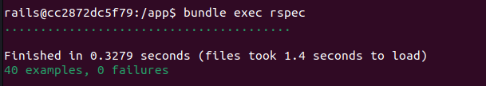

# Projeto ZOMBIE, a humanidade está por um fio !

### Para utilizar o projeto apenas faça o clone desse repositório e siga os passos abaixo:

#### 1 - Entrar na pasta zombie
#### 2 - Fazer o build do projeto com `docker compose build`
#### 3 - Iniciar a aplicaação `docker compose up`
#### 4 - Entrar no bash `docker compose run zombie bash`
#### 4.1 - Rodar o comando `rails db:create` dentro do bash
#### 4.2 - Rodas as migrations `rails db:migrate` dentro do bash
#### 4.3 - Para rodas os testes utilize `bundle exec rspec` dentro do 

---------------------

## Rotas da API

### 1 - Usuários (user)

#### 1.1 - Criar um usuário (create user)

Para criar um novo usuário, envie uma solicitação **POST** para a rota `http://0.0.0.0:3000/users` com o seguinte **BODY**:

```json
{
  "name": "User 2",
  "age": 30,
  "gender": "M",
  "latitude": 40.7128,
  "longitude": -74.006
}
```

#### 1.2 - Listar usuários (index users)

Para listar os usuários envie uma solicitação **GET** para a rota `http://0.0.0.0:3000/users?page=1` com o **BODY** vazio.

```json
{}
```

Obs. É possivel selecionar qual pagina deseja trazer basta passar o parametro **page** na url.

#### 1.3 - Listar um usuário (show user)

Para listar apenas um usuário envie uma solicitação **GET** para a rota `http://0.0.0.0:3000/users/1` passando o **ID** do usuário desejado na url e com o **BODY** vazio.

```json
{}
```

#### 1.4 - Alterar um usuário (update user)

Para alterar um usuário, envie uma solicitação **PUT** para a rota `http://0.0.0.0:3000/users/1` passando o **ID** do usuário que sofrerá a alteração com o seguinte **BODY**:

```json
{
"age":40
}

```

Obs. Poderá ser enviado os demais campos do usuário para alteração.

#### 1.5 - Excluir um usuário (delete user)

Para listar apenas um usuário envie uma solicitação **DELETE** para a rota `http://0.0.0.0:3000/users/1` passando o **ID** do usuário desejado na url e com o **BODY** vazio.

```json
{}
```


### 2 - Inventário (inventory)

#### 2.1 - Adicionar um item no inventáro (Add Item in Inventory)

Para adicionar um item no iventário do usuário, envie uma solicitação **POST** para a rota `http://0.0.0.0:3000/inventories` com o seguinte **BODY**:

```json
{
"item":"munição",
"user_id":1,
"quantity": 100
}

```

Obs. Os valores do item são `['água', 'comida', 'medicamento', 'munição'] `. E o user_id representa o valor do usuário que será adicionado o item do inventário.
Essaação apenas irá atualizar a quantidade do item no iventário.

#### 2.2 - Listar itens do inventário (index inventory)

Para listar os itens do inventário basta fazer uma solicitação **GET** para a rota `http://0.0.0.0:3000/inventories`. Pode ser enviado o **ID** do usuário desejado na url, assim como a página ficando a url dessa forma `http://0.0.0.0:3000/inventories?page=1&user_id=25` e com o **BODY** vazio.

```json
{}
```

### 3 - Marcar um usuário como infectado (mark infected)

#### 3.1 - Marcar um usuário como infectado (mark infected)

Para marcar um usuário como infectado, envie uma solicitação **POST** para a rota `http://0.0.0.0:3000/mark_infected` com o seguinte **BODY**:

```json
{
"user_id": 4,
"user_id_infected": 22
}


```

Obs. O valor `user_id` representa o **ID** do usuário que está informando a infecção e o valor do `user_id_infected` representa o usuário que está infectado. 

### 4 - Escambo (exchanges)

#### 4.1 - Fazer o escambo de um item (exchanges)

Para realizar o escambo de items, envie uma solicitação **POST** para a rota `http://0.0.0.0:3000/exchanges` com o seguinte **BODY**:

```json
{
  "user_first_id": 25,
  "user_second_id": 26,
  "user_first_items": {
    "24": 1,
		"26": 1
  },
  "user_second_items": {
    "27": 1
  }
}
```
Obs. O valor `user_first_id` representa o **ID** do primeiro usuário que está participando do escambo, o `user_second_id` representa o **ID** do segundo usuário que vai fazer o escambo.

Dentro `user_first_items` e `user_second_items` temos os valores **ID** que representa o id do item na tavela de Inventário e **QUANTIDADE** representa a quantidade de itens para escambo. 

### 5 - Relatório (reports)

#### 5.1 - Listar relatório (reports)

Para trazer o relatório basta fazer uma solicitação **GET** para a rota `http://0.0.0.0:3000/reports` e com o **BODY** vazio.

```json
{}
```

---

## Evidência de testes

### Para rodar os testes basta entrar no bash e usar o comando `bundle exec rspec` 

### Evidência dos testes executados

